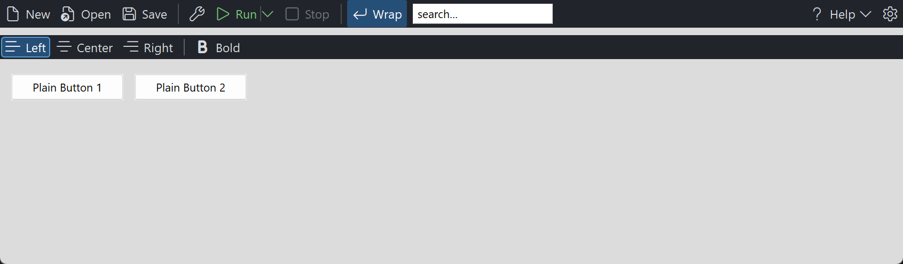

# PsToolbar

An owner-drawn command toolbar for FreeBASIC / Win32. A horizontal strip of buttons, each with
an optional icon and an optional caption, plus separators, split buttons, dropdown buttons, and
cells that hold a child window of your own. When the strip runs out of room the items that no
longer fit move into an overflow menu behind a chevron.

Items belong to one end of the bar or the other: left-gravity items pack forward from the left,
right-gravity items pack against the right edge, so the "settings and help on the right" layout
is expressed directly rather than by arithmetic. Toggle items can latch independently or form a
mutually exclusive radio group.

The control owns its own painting, its geometry, its dropdown menus and its tooltips. It does
**not** own your commands or your child windows: a `TBR_KIND_CONTROL` cell positions a window you
created and destroys nothing, and the contents of a split or dropdown button's menu are yours to
fill. It is **mouse-driven only** — it takes no focus and no tab stop, so it never steals the
caret from an editor, and it has no keyboard interface of its own.

Repository: <https://github.com/PaulSquires/PsToolbar>

## What it looks like



## Requirements

| File | Purpose |
|---|---|
| `PsToolbar.bi` / `PsToolbar.inc` | the control |
| `PsPopupMenu.bi` / `PsPopupMenu.inc` | dropdown and overflow menus |
| `PsBufferPaint.bi` / `PsBufferPaint.inc` | the flicker-free drawing surface |
| `SegoeFluentIcons.ttf` | optional — only if you use Segoe Fluent Icons glyphs |

Copy all six source files into your project. If you already vendor `PsPopupMenu` or
`PsBufferPaint`, you get one copy of each — `#include once` dedupes by resolved path.

### Include order

`PsToolbar.bi` names types from both siblings, so their implementations must be compiled in
first:

```freebasic
#include once "PsBufferPaint.inc"
#include once "PsPopupMenu.inc"
#include once "PsToolbar.inc"
```

### GDI+ must be running

All geometry is drawn through GDI+. Initialise it before the first repaint and shut it down
after every window is destroyed:

```freebasic
dim as ULONG_PTR gdipToken = AfxGdipInit()
    ' ... create windows, run the message loop ...
AfxGdipShutdown( gdipToken )
```

Without this the control draws nothing at all.

### Never name an identifier `ok`

GDI+ defines `Ok = 0` as a `Status` enum value in namespace `AfxNova`, and hosts say
`using AfxNova`. FreeBASIC is case-insensitive, so any variable of yours called `ok` becomes a
duplicate definition the moment you adopt this control. Use `bOK`.

### The message pump — required

`PsToolbar_FilterMessage` is **mandatory**. Call it for every toolbar, before your accelerator
and dispatch handling:

```freebasic
do while GetMessage( @uMsg, null, 0, 0 )
    if PsToolbar_FilterMessage( hToolbar, @uMsg ) then continue do
    TranslateMessage @uMsg
    DispatchMessage  @uMsg
loop
```

Without it a dropdown has no keyboard navigation, never closes when you click outside it, and
cannot be closed by clicking the very chevron that opened it. The call returns immediately when
none of that toolbar's menus are open, so calling it for several toolbars costs almost nothing.

There is no `IsDialogMessage` obligation for the toolbar itself — it takes no tab stop. If you
put a `TBR_KIND_CONTROL` child in it that should be reachable by Tab, your form needs
`IsDialogMessage` as it would for any other child control.

## Quick start

```freebasic
ghToolbar = PsToolbar_Create( hMain, IDC_TOOLBAR )

PsToolbar_SetTextFont(  ghToolbar, ghFont(GUIFONT_10) )
PsToolbar_SetGlyphFont( ghToolbar, ghFont(SYMBOLFONT_12) )
PsToolbar_SetClickCallback( ghToolbar, @OnToolbarClick )

PsToolbar_AddItem( ghToolbar, TBR_KIND_COMMAND, !"\uE7C3", "New",  IDM_NEW )
PsToolbar_AddItem( ghToolbar, TBR_KIND_COMMAND, !"\uE8E5", "Open", IDM_OPEN )
PsToolbar_AddSeparator( ghToolbar )

' A split button: the left half runs, the chevron drops a menu.
dim as long idxRun = PsToolbar_AddItem( ghToolbar, TBR_KIND_SPLIT, !"\uE768", "Run", IDM_RUN )

' Pinned to the right-hand end.
dim as long idxCfg = PsToolbar_AddItem( ghToolbar, TBR_KIND_COMMAND, !"\uE713", "", IDM_SETTINGS )
PsToolbar_SetItemGravity(  ghToolbar, idxCfg, TBR_GRAVITY_RIGHT )
PsToolbar_SetTooltipText(  ghToolbar, idxCfg, "Settings" )

ShowWindow( ghToolbar, SW_SHOW )
```

Size and place it like any window — `PsToolbar_GetIdealSize` gives you the height it wants and
the width it would need in order not to overflow:

```freebasic
dim as long nWant, nHeight
PsToolbar_GetIdealSize( ghToolbar, nWant, nHeight )
SetWindowPos( ghToolbar, 0, rc.left, rc.top, rc.right - rc.left, nHeight, SWP_NOZORDER )
```

Write icon glyphs as `!"\uXXXX"` escape sequences, never as literal characters pasted into
the source. FreeBASIC reads a source file that has no UTF-8 BOM as raw bytes, so a pasted Segoe
Fluent Icons character arrives as three unrelated Latin-1 characters and draws garbage. The
escape form is converted by the compiler and works whatever the file encoding.

The click callback:

```freebasic
sub OnToolbarClick( byval hToolbar as HWND, byval idx as long, byval id as long )
    select case id
    case IDM_NEW  : DoFileNew()
    case IDM_OPEN : DoFileOpen()
    end select
end sub
```

## Concepts

### The control handle is a real HWND

`PsToolbar_Create` returns an ordinary `HWND`. Move and size it with `SetWindowPos`, show it with
`ShowWindow`. It is created zero-sized, so nothing appears until you place it.

### Item kinds

| Kind | Behaviour |
|---|---|
| `TBR_KIND_COMMAND` | Momentary. Draws pressed while held, fires `ClickCallback` on a matched release. |
| `TBR_KIND_TOGGLE` | Latches. Fires `SelChangeCallback`. With a group id it becomes a radio button. |
| `TBR_KIND_SEPARATOR` | A vertical rule the control draws. Never hit-testable. |
| `TBR_KIND_SPLIT` | Two zones: an action zone that behaves like `COMMAND`, and a chevron zone that opens the item's menu. |
| `TBR_KIND_DROPDOWN` | The whole cell opens the item's menu. No action zone. |
| `TBR_KIND_CONTROL` | A cell of declared width holding a child window you created. |

### Geometry is derived, never set

You supply paddings, an icon size, a text gap and per-item overrides; the control computes every
rectangle. Layout is lazy — a burst of `AddItem` calls costs one layout pass, and any geometry
query forces a pending one, so results are always current.

```
cellWidth = padBefore + content + padAfter

content   = iconWidth                                      icon only
          = textWidth                                      caption only
          = iconWidth + textGap + textWidth                 both
          = separatorWidth                                  SEPARATOR
          = controlWidth                                    CONTROL
          + chevronGap + dividerThickness + chevronWidth     SPLIT
          + chevronGap +                    chevronWidth     DROPDOWN

idealHeight = padTop + max( textHeight, iconHeight ) + padBottom
```

A gap is charged **only when there is something on both sides of it**, so an icon-only item is
legitimately narrower than a captioned neighbour, and icon-only, caption-only and icon+caption
all come out of one formula.

### Gravity, and where the overflow chevron sits

Left-gravity items pack forward from the client's left edge in the order you added them.
Right-gravity items pack against the right edge, also in the order you added them, so the *last*
right-gravity item sits hard against the right edge. The overflow chevron appears immediately
inboard of the right-hand run — at the trailing edge of the flowing area, where a user looks for
it — so it never displaces a pinned right-hand item.

When the run does not fit, items are moved into the overflow menu in this order:

1. from the **tail of the left run** (its last item first), then
2. from the **front of the right run** (its leftmost item first), so the outermost right-hand
   items survive longest.

`TBR_KIND_CONTROL` cells are never moved into the menu — a window cannot live inside one. If a
control cell cannot be placed at all it is hidden.

### Two fonts

The **text font** is a layout input: changing it re-measures every caption and moves everything.
The **glyph font** is a paint-time input only — the icon cell is a size you declare, never
measured, so a glyph too large for its cell simply clips. Both fonts are borrowed; keep them
alive and destroy them yourself.

### Programmatic setters are silent

`PsToolbar_SetSelected` changes state without firing `SelChangeCallback`, which is what makes it
safe to call from inside your own handler. Only user interaction notifies. The two exceptions are
named as actions rather than setters: `PsToolbar_Click` and `PsToolbar_Toggle` **do** fire, which
is how an accelerator drives the toolbar.

### Radio groups

Give two or more `TBR_KIND_TOGGLE` items the same non-zero group id and checking one unchecks the
others. Both edges are reported, **loser first**, and both state writes land before either
callback — so a handler that reads the whole group sees a coherent one rather than a moment with
two members checked. Clicking the member that is already checked is a silent no-op, exactly as a
radio button behaves. "Nothing checked" is a legal state you can set programmatically but the
user cannot reach.

### Menus are themed from the bar

`PSPOPUPMENU_COLORS` carries no defaults except its separator colour, so a popup menu that is
never given colours renders black on black. Every menu this toolbar creates is therefore themed
from `PSTOOLBAR_COLORS` at creation, and re-themed whenever you call `PsToolbar_SetColors` — so
theming the bar themes its menus for free and you set one palette.

If you want a different look for the menus, `PsToolbar_SetMenuColors` claims them permanently:
from then on a bar re-theme leaves them alone, and menus created later still get your palette.

### Menus are owned by the toolbar, filled by you

`PsToolbar_GetItemMenu` creates the item's `PsPopupMenu` on first call and hands it to you. Fill
it like any popup menu, and handle its commands with **`PsPopupMenu_SetSelectCallback`** — do not
call `PsPopupMenu_SetNotifyWindow` on it, because the toolbar registers itself there to track the
menu's open/closed state. The toolbar destroys every menu it created when it is destroyed.

The **overflow** menu is different: its contents are rebuilt from scratch on every open, so rows
you add to it will be gone next time. Its row ids are `item index + 1`, so your own command ids
never enter its command stream. Picking a row activates that item exactly as clicking it on the
strip would, through the same code path — your `ClickCallback` does not need to know which
happened.

### Child windows in a CONTROL cell

Parent the child to the **toolbar**, not to your form: the toolbar positions it with
`SetWindowPos` in its own client coordinates. You create it, you own it, you destroy it. On
`PsToolbar_DeleteItem` or `PsToolbar_Clear` the child is hidden and forgotten, never destroyed.

## Behaviour and limits

- **Horizontal only.** There is no vertical orientation.
- **No focus, no tab stop, no keyboard.** The toolbar is mouse-driven. Reach commands from the
  keyboard through your own accelerators and `PsToolbar_Click`.
- **The overflow menu does not scroll.** `PsPopupMenu` has no scrolling, so an overflow list
  taller than the work area is clipped. This is a control for a dozen or so items squeezed into a
  narrow bar, not for fifty.
- **Only one menu chain is open at a time.** Opening a second dropdown closes the first, and the
  first reports its closing edge.
- **A `TBR_KIND_CONTROL` cell is never moved into the overflow menu.** If it cannot be placed it
  is hidden.
- **Trimmed separators do not reclaim their space.** A separator that ends up leading or trailing
  the visible run is suppressed and costs nothing, but the width it frees is not given back to
  another item — the overflow split is not recomputed.
- **An icon-only item with no tooltip has no readable name.** If it overflows it appears in the
  menu as `#n`. Give any item that might overflow a caption or a tooltip.
- **A split button's chevron zone owns the trailing padding**, so clicks near the right edge of a
  split button open the menu rather than firing the action.
- **A dropdown opens on the button-down**, not the release.
- **No double-click.** `CS_DBLCLKS` is off, so every click of a rapid pair is delivered — a toggle
  clicked twice quickly toggles twice.

## API reference

### Creation

| Function | Behaviour |
|---|---|
| `PsToolbar_Create( hWndParent, CtrlID ) as HWND` | Creates the control, zero-sized. `CtrlID` becomes `GWLP_ID`. |

### Building the bar

The item set is fully dynamic. The control fixes up its own internal indices across a mutation;
if *you* hold an item index across one, fix up yours.

| Function | Behaviour |
|---|---|
| `PsToolbar_AddItem( h, itemKind, Glyph, Text, id, itemData ) as long` | Appends. Returns the new index, or −1. |
| `PsToolbar_InsertItem( h, idx, itemKind, Glyph, Text, id, itemData ) as long` | Inserts at `idx`; `idx = count` appends. Returns `idx`, or −1 if past the end. |
| `PsToolbar_AddSeparator( h ) as long` | Appends a separator. |
| `PsToolbar_AddControl( h, hChild, nControlWidth, nControlHeight, id ) as long` | Appends a cell holding your child window. `nControlHeight = 0` fills the cell height. |
| `PsToolbar_DeleteItem( h, idx ) as boolean` | Removes one item, compacting the rest down. Destroys that item's menu; hides but never destroys its child window. |
| `PsToolbar_Clear( h )` | Removes every item, destroys every menu, hides every child, resets all internal state. |
| `PsToolbar_Refresh( h )` | Marks the layout stale and requests a repaint. |

### Counts and lookup

| Function | Behaviour |
|---|---|
| `PsToolbar_GetCount( h ) as long` | Number of items, visible or not. |
| `PsToolbar_IsValidItem( h, idx ) as boolean` | Is `idx` in range. |
| `PsToolbar_FindItemByID( h, id ) as long` | First item with that id, or −1. |
| `PsToolbar_HitTest( h, x, y ) as long` | Item at that client point, or −1. Separators, hidden and overflowed items are excluded; disabled items are not. |
| `PsToolbar_HitTestEx( h, x, y, byref nZone ) as long` | As above and reports `TBR_ZONE_*`. The only way to tell a split button's action zone from its chevron. Returns −1 with `nZone = TBR_ZONE_OVERFLOW` over the overflow chevron. |

### Item content and state

| Function | Behaviour |
|---|---|
| `PsToolbar_GetItemKind( h, idx ) as long` | `TBR_KIND_*`, or −1 for an invalid index. |
| `PsToolbar_GetGlyph( h, idx ) as DWSTRING` | The item's icon glyph. |
| `PsToolbar_SetGlyph( h, idx, Glyph ) as boolean` | Sets it. Adding or removing a glyph changes whether the icon cell and text gap are charged, so this re-lays out. |
| `PsToolbar_GetText( h, idx ) as DWSTRING` | The item's caption. |
| `PsToolbar_SetText( h, idx, Text ) as boolean` | Sets it and re-measures. |
| `PsToolbar_GetItemID( h, idx ) as long` | The command id. |
| `PsToolbar_SetItemID( h, idx, id ) as boolean` | Sets it. No layout change. |
| `PsToolbar_GetItemData( h, idx ) as integer` | Free-form payload. |
| `PsToolbar_SetItemData( h, idx, itemData ) as boolean` | Sets it. |
| `PsToolbar_GetSelected( h, idx ) as boolean` | Is this toggle latched. |
| `PsToolbar_SetSelected( h, idx, isSelected ) as boolean` | **Silent**, but still enforces a radio group — it will uncheck the item's group siblings. |
| `PsToolbar_GetEnabled( h, idx ) as boolean` | |
| `PsToolbar_SetEnabled( h, idx, isEnabled ) as boolean` | Disabling greys the item, stops it going hot and makes it swallow clicks. Disabling the item under a live press cancels the press. |
| `PsToolbar_GetVisible( h, idx ) as boolean` | |
| `PsToolbar_SetVisible( h, idx, isVisible ) as boolean` | Hiding removes the item from layout, hit-testing and overflow entirely — it stops occupying width, it is not merely blank. Hides a control cell's child too. |
| `PsToolbar_GetItemGroupID( h, idx ) as long` | 0 = independent. |
| `PsToolbar_SetItemGroupID( h, idx, nGroupID ) as boolean` | Joins a radio group. If the item is already checked the group is enforced immediately, silently. |
| `PsToolbar_FindCheckedInGroup( h, nGroupID ) as long` | The checked member, or −1. Returns −1 for group id 0. |
| `PsToolbar_GetItemGravity( h, idx ) as long` | `TBR_GRAVITY_LEFT` / `TBR_GRAVITY_RIGHT`. |
| `PsToolbar_SetItemGravity( h, idx, nGravity ) as boolean` | Moves the item to the other end of the bar. |
| `PsToolbar_GetItemChild( h, idx ) as HWND` | The child window of a control cell, or 0. |
| `PsToolbar_Click( h, idx ) as boolean` | An **action**: activates the item and **fires** `ClickCallback` (or toggles, or opens a dropdown, by kind). Refuses invalid, disabled, separator and control items. The door for an accelerator. |
| `PsToolbar_Toggle( h, idx ) as boolean` | Flips a toggle as a user click would, enforcing its group, and **fires** `SelChangeCallback`. Refuses anything that is not an enabled `TBR_KIND_TOGGLE`. |

### Geometry and layout

Bar-level setters take **raw pixels** — you DPI-scale them. Only the Create-time defaults are
scaled for you. Every geometry query forces a pending layout.

| Function | Behaviour |
|---|---|
| `PsToolbar_GetIconSize( h, byref w, byref hgt )` | |
| `PsToolbar_SetIconSize( h, nIconWidth, nIconHeight )` | Ignores values ≤ 0. |
| `PsToolbar_GetPadding( h, byref before, byref after, byref top, byref bottom )` | |
| `PsToolbar_SetPadding( h, nPadBefore, nPadAfter, nPadTop, nPadBottom )` | Ignores negative values, so you can set one and pass −1 for the rest. |
| `PsToolbar_GetTextGap( h ) as long` | |
| `PsToolbar_SetTextGap( h, nTextGap )` | Space between icon and caption. Charged only when there is a caption. |
| `PsToolbar_GetSeparatorWidth( h ) as long` | |
| `PsToolbar_SetSeparatorWidth( h, nSepWidth )` | Thickness of a separator's rule. |
| `PsToolbar_GetSeparatorHeight( h ) as long` | |
| `PsToolbar_SetSeparatorHeight( h, nSepHeight )` | 0 derives the rule's height from the content band. |
| `PsToolbar_GetChevronSize( h, byref w, byref gap )` | |
| `PsToolbar_SetChevronSize( h, nChevronWidth, nChevronGap )` | Width of the chevron zone, and the gap charged before it — before the chevron on a dropdown, before the divider on a split button. |
| `PsToolbar_GetDividerThickness( h ) as long` | |
| `PsToolbar_SetDividerThickness( h, nThickness )` | The hairline inside a split button. Not DPI-scaled — a hairline stays a hairline. |
| `PsToolbar_GetCornerCurvature( h ) as long` | |
| `PsToolbar_SetCornerCurvature( h, nCurvature ) ` | Rounding of the hot/pressed/selected fill; 0 is square. Repaints without re-laying out. |
| `PsToolbar_SetItemPadding( h, idx, nPadBefore, nPadAfter ) as boolean` | Per-item override; −1 goes back to inheriting. |
| `PsToolbar_SetItemIconSize( h, idx, nIconWidth, nIconHeight ) as boolean` | Per-item override; 0 goes back to inheriting. |
| `PsToolbar_SetItemControlSize( h, idx, nControlWidth, nControlHeight ) as boolean` | Resizes a control cell. Ignores negative values. |
| `PsToolbar_GetItemRect( h, idx, byref rc ) as boolean` | The whole cell. Empty for a hidden, overflowed or trimmed item. |
| `PsToolbar_GetItemIconRect( h, idx, byref rc ) as boolean` | The icon box — or, for a separator, the rule. |
| `PsToolbar_GetItemTextRect( h, idx, byref rc ) as boolean` | The caption **span**, not the ink. Empty when there is no caption. |
| `PsToolbar_GetItemChevronRect( h, idx, byref rc ) as boolean` | The chevron glyph box. Empty except on split and dropdown items. |
| `PsToolbar_GetOverflowRect( h, byref rc ) as boolean` | The overflow button's cell. Returns FALSE and an empty rect when nothing overflows. |
| `PsToolbar_GetIdealSize( h, byref nWidth, byref nHeight )` | Width the whole run wants, and the height the tallest content needs. Valid **before** the control has ever been sized. |
| `PsToolbar_GetIdealWidth( h ) as long` | The width half of the above. |
| `PsToolbar_IsItemOverflowed( h, idx ) as boolean` | Is this item currently in the overflow menu. |
| `PsToolbar_GetOverflowCount( h ) as long` | How many items are, excluding trimmed separators. |

### Appearance

| Function | Behaviour |
|---|---|
| `PsToolbar_GetColors( h, pColors )` | Fills your struct — the read half of read-modify-write. |
| `PsToolbar_SetColors( h, pColors )` | Copies the whole struct and repaints. |
| `PsToolbar_SetItemForeColor( h, idx, clr ) as boolean` | Overrides one item's **idle** foreground. Hot, pressed, selected and disabled keep the bar's colours. |
| `PsToolbar_ClearItemForeColor( h, idx ) as boolean` | Back to the bar's foreground. |
| `PsToolbar_GetTextFont( h ) as HFONT` | |
| `PsToolbar_SetTextFont( h, hTextFont ) as boolean` | A **layout** input: re-measures every caption. Also re-applies the fonts to any menus the toolbar owns. |
| `PsToolbar_GetGlyphFont( h ) as HFONT` | |
| `PsToolbar_SetGlyphFont( h, hGlyphFont ) as boolean` | A **paint-time** input only: repaints, never re-lays out. |
| `PsToolbar_GetGlyphs( h, byref wszChevron, byref wszOverflow )` | The two chrome glyphs. |
| `PsToolbar_SetGlyphs( h, wszChevron, wszOverflow )` | The split/dropdown chevron and the overflow button glyph. |

If no text font is set the control measures and paints with the stock GUI font; if no glyph font
is set it uses the text font. Measuring and painting always use the same font.

### Menus

| Function | Behaviour |
|---|---|
| `PsToolbar_GetItemMenu( h, idx ) as HWND` | Creates the item's menu on first call and returns it thereafter. The toolbar destroys it. Handle its commands with `PsPopupMenu_SetSelectCallback`. |
| `PsToolbar_GetOverflowMenu( h ) as HWND` | The overflow menu — for theming only. Its rows are rebuilt on every open. |
| `PsToolbar_SetMenuColors( h, pColors )` | Claims the palette of **every** menu this toolbar owns, present and future. After this, re-theming the bar no longer touches them. |
| `PsToolbar_IsDroppedDown( h ) as boolean` | Is any menu of this toolbar's open. |
| `PsToolbar_GetDroppedItem( h ) as long` | Which item's menu is open; −1 for the overflow menu **or** for nothing. Pair with `IsDroppedDown` to tell those apart. |
| `PsToolbar_DropDown( h, idx ) as boolean` | Opens a menu programmatically; `idx = -1` opens the overflow menu. Still fires `DropDownCallback`. Returns FALSE — and reports a balanced open/close pair — if the menu has no rows. |
| `PsToolbar_CloseUp( h )` | Closes whatever is open and fires the closing edge. A no-op when nothing is open. |

### Tooltips

| Function | Behaviour |
|---|---|
| `PsToolbar_GetTooltipText( h, idx ) as DWSTRING` | The item's own tooltip text. |
| `PsToolbar_SetTooltipText( h, idx, Text ) as boolean` | Sets it. Per-item text wins over the callback. |
| `PsToolbar_GetTooltipHandle( h ) as HWND` | The underlying tooltip window, for `TTM_*` customisation. |
| `PsToolbar_SetHoverTime( h, milliseconds )` | Hover delay before a tip appears. Ignores values ≤ 0. |

An item with neither its own text nor a callback answer shows no tooltip. There is no automatic
fallback to the caption.

### Callback registration

| Function | Behaviour |
|---|---|
| `PsToolbar_SetPaintItemCallback( h, usersub )` | Replaces the built-in painter for **every** item. |
| `PsToolbar_SetMessageCallback( h, userfunc )` | Observe mouse messages. |
| `PsToolbar_SetTooltipCallback( h, userfunc )` | Supply tooltip text on demand. |
| `PsToolbar_SetClickCallback( h, usersub )` | Command and split-action clicks. |
| `PsToolbar_SetSelChangeCallback( h, usersub )` | Toggle latch/unlatch by the user. |
| `PsToolbar_SetDropDownCallback( h, usersub )` | Menu opened or closed. |

Pass `0` to any of these to remove the callback.

### Message pump and probes

| Function | Behaviour |
|---|---|
| `PsToolbar_FilterMessage( h, pMsg ) as MSG ptr → boolean` | **Required** in your message loop. Returns TRUE when the message was consumed and must not be dispatched. Returns FALSE immediately when no menu is open. |
| `PsToolbar_CountRenderedTones( h, nPart, idx ) as long` | Renders the bar offscreen and counts distinct colours inside one `TBR_PART_*` rect. |
| `PsToolbar_HashRenderedPart( h, nPart, idx ) as ulong` | FNV-1a hash of the same rect. |

The two probes are public so that a host writing its own paint callback can check it: a low tone
count means the callback is flooding the control, and two equal hashes across a state change mean
the change never reached the pixels. Measure your own healthy and broken values — a threshold
that works for one part rect does not transfer to another.

### Pure helpers

These take no handle and touch no window, so you can use them to reason about layout before you
build one.

| Function | Behaviour |
|---|---|
| `PsToolbar_ComputeCellWidth( nKind, nIconWidth, nTextWidth, nTextGap, nSepWidth, nControlWidth, nChevronWidth, nChevronGap, nDividerThick, nPadBefore, nPadAfter ) as long` | The cell-width formula from *Concepts*. A zero width means that part is absent. |
| `PsToolbar_ComputeOverflowSplit( nCellW(), nGravity(), nKind(), nCount, nClientW, nOverflowCellW, bOverflow(), byref bNeedOverflow )` | Decides which of the visible items leave the strip. Arrays are indexed over visible items only, in author order. |
| `PsToolbar_ResolveMood( isEnabled, isPressed, isHot ) as long` | The `TBR_MOOD_*` precedence, so your painter agrees with the control's. |

## Colors

`PSTOOLBAR_COLORS`, copied on `SetColors`. Defaults are a dark theme; a light-theme host sets all
nine.

| Field | Paints | When |
|---|---|---|
| `BackColor` | The bar background, and every cell's base fill | Always — the state fill is drawn *over* it |
| `ForeColor` | Glyph and caption | Idle |
| `BackColorHot` | The cell fill | Pointer over the item |
| `ForeColorHot` | Glyph and caption | Pointer over the item |
| `BackColorSelect` | The cell fill | Latched toggle, **and** the pressed flash |
| `ForeColorSelect` | Glyph and caption | Latched toggle, and pressed |
| `ForeColorDisabled` | Glyph and caption | Disabled |
| `SeparatorColor` | A separator's rule | Always |
| `SplitDividerColor` | The hairline between a split button's two zones | Always, on split items |

State precedence, resolved by `PsToolbar_ResolveMood` so every renderer agrees:

```
disabled > pressed > hot > idle
```

`isSelected` is deliberately not part of that ladder — a latched toggle can also be hot or
pressed. The painter combines the two: a selected idle item takes the Select pair, and a selected
disabled item keeps the Select background under the disabled foreground.

Pressed reuses the Select pair rather than adding a tenth colour: on a command item it is the
flash that makes the button feel pressed, and on a toggle it previews the latched look the
release is about to produce. An open dropdown paints hot, so the button stays lit while its menu
is up.

The state fill is a rounded rect drawn **over** the base fill, so the bar background always shows
in the gaps between cells and an item reads as a pill. On a split button a hover lights only the
half the pointer is over.

## Callbacks

### Paint

```freebasic
type TBR_PaintItemCallbackSub as sub( byval p as PSTOOLBAR_PAINTINFO ptr )
```

Setting this replaces the built-in painter for **every** item, separators and the overflow button
included. The overflow button arrives with `itemID = -1` and `itemKind = TBR_KIND_DROPDOWN`, so
one renderer can serve both.

Three rules:

- **Fill `p->rc`, not `p->rcIcon`.** `rc` includes the item's padding; leaving part of it
  unpainted shows the bar background through.
- **Do not stroke a frame with `PaintBorderRect`** — it fills before it strokes and will erase
  everything beneath. Use `PaintRoundOutline`. `PsToolbar_CountRenderedTones` exists so you can
  check you have not.
- **Draw the caption in the font you gave `PsToolbar_SetTextFont`.** The control measured with
  it; painting a bolder variant makes the cell too small and the caption ellipsize. If you want
  bold, hand the bold font to `SetTextFont` so measuring and painting agree.

`PSTOOLBAR_PAINTINFO`:

| Field | Meaning |
|---|---|
| `hToolbar` | The control, so the callback can query it |
| `itemID` | Model index; −1 for the overflow button |
| `b` | The control's `PsBufferPaint` for this repaint — paint through this, never the screen DC |
| `itemKind` | `TBR_KIND_*` |
| `rc` | The whole cell: fill this |
| `rcIcon` | The icon box — or a separator's rule |
| `rcText` | The caption **span**, not the ink, so `DT_END_ELLIPSIS` has somewhere to ellipsize into |
| `rcChevron` | The chevron box; empty except on split and dropdown items |
| `nMood` | `TBR_MOOD_*` |
| `isHot` | The pointer is over this item |
| `isSelected` | A latched toggle |
| `isPressed` | A live press is on this item **and** the cursor is still over it |
| `isEnabled` | |
| `isChevronHot` | The pointer is specifically over a split button's chevron zone; always FALSE for other kinds |
| `isDropped` | This item's menu is currently open |
| `wszGlyph` | The icon glyph |
| `wszText` | The caption |

### Message

```freebasic
type TBR_MessageCallbackFunc as function( byval m as PSTOOLBAR_MESSAGEINFO ptr ) as boolean
```

Return TRUE to suppress the control's own handling of that message.

**The result is ignored for `WM_LBUTTONUP`.** The control holds mouse capture across a press on
an action zone and the up-message is what releases it; a callback that suppressed it would strand
the capture and route every later click to this control. Suppressing `WM_LBUTTONDOWN` suppresses
the press, never the capture bookkeeping.

| Field | Meaning |
|---|---|
| `hToolbar` | |
| `uMsg`, `wParam`, `lParam` | The raw message |
| `idx` | Item under the mouse, or −1 |
| `nZone` | `TBR_ZONE_*` |

### Tooltip

```freebasic
type TBR_TooltipCallbackFunc as function( byval hToolbar as HWND, byval idx as long ) as DWSTRING
```

Consulted only when the item has no tooltip text of its own, and only when a tip is about to
show. Return `""` for no tooltip.

### Click

```freebasic
type TBR_ClickCallbackSub as sub( byval hToolbar as HWND, byval idx as long, byval id as long )
```

A matched press and release on the same zone of a command item, or a split button's action zone.
Nothing fires for a cancelled gesture — press, slide off, release. Toggles report through
`SelChangeCallback` instead.

It **also** fires for a pick from the overflow menu, so a handler never has to know whether the
item was on the strip or behind the chevron.

### Selection change

```freebasic
type TBR_SelChangeCallbackSub as sub( byval hToolbar as HWND, byval idx as long, byval isSelected as boolean )
```

A toggle latched or unlatched **by the user**. Fires after the state is updated, so
`PsToolbar_GetSelected` already agrees. For a radio group both edges fire, loser first, with both
state writes landing before either callback. `PsToolbar_SetSelected` does not fire it.

### Drop down

```freebasic
type TBR_DropDownCallbackSub as sub( byval hToolbar as HWND, byval idx as long, byval hMenu as HWND, byval isOpen as boolean )
```

`idx` is −1 for the overflow menu. It reports a window-state transition, not a value change, so
it fires for programmatic opens too.

For a split or dropdown item the opening edge runs **before a single row is built** — that is the
just-in-time hook for a menu whose contents change:

```freebasic
sub OnDropDown( byval hToolbar as HWND, byval idx as long, byval hMenu as HWND, byval isOpen as boolean )
    if isOpen = false then exit sub
    if idx = -1 then exit sub          ' the overflow menu builds itself
    PsPopupMenu_Clear( hMenu )
    PsPopupMenu_AddItem( hMenu, IDM_RUN_DEBUG,   "Run in Debugger", "F5" )
    PsPopupMenu_AddItem( hMenu, IDM_RUN_RELEASE, "Run Release",     "Ctrl+F5" )
end sub
```

The overflow menu is the exception: the control fills it from the items that did not fit, and its
opening edge fires after it is built.

## Constants

### Item kinds — `PSTOOLBAR_ITEMKIND`

| Constant | |
|---|---|
| `TBR_KIND_COMMAND` | 0 |
| `TBR_KIND_TOGGLE` | 1 |
| `TBR_KIND_SEPARATOR` | 2 |
| `TBR_KIND_SPLIT` | 3 |
| `TBR_KIND_DROPDOWN` | 4 |
| `TBR_KIND_CONTROL` | 5 |

### Gravity — `PSTOOLBAR_GRAVITY`

`TBR_GRAVITY_LEFT` (0), `TBR_GRAVITY_RIGHT` (1)

### Hit zones — `PSTOOLBAR_HITZONE`

| Constant | Meaning |
|---|---|
| `TBR_ZONE_NONE` | Nothing there |
| `TBR_ZONE_ACTION` | The item's main body |
| `TBR_ZONE_CHEVRON` | A split button's dropdown zone |
| `TBR_ZONE_OVERFLOW` | The overflow chevron; the item index is −1 |

### Parts — `PSTOOLBAR_PART`

`TBR_PART_TOOLBAR`, `TBR_PART_ITEM`, `TBR_PART_ICON`, `TBR_PART_TEXT`, `TBR_PART_CHEVRON`

### Moods — `PSTOOLBAR_MOOD`

`TBR_MOOD_IDLE`, `TBR_MOOD_HOT`, `TBR_MOOD_PRESSED`, `TBR_MOOD_DISABLED`

### Defaults

DPI-scaled at Create unless noted. Setters afterwards take raw pixels.

| Constant | Value |
|---|---|
| `PSTOOLBAR_DEFAULT_ICONWIDTH` / `_ICONHEIGHT` | 16 / 16 |
| `PSTOOLBAR_DEFAULT_PADBEFORE` / `_PADAFTER` | 6 / 6 |
| `PSTOOLBAR_DEFAULT_PADTOP` / `_PADBOTTOM` | 4 / 4 |
| `PSTOOLBAR_DEFAULT_TEXTGAP` | 6 |
| `PSTOOLBAR_DEFAULT_SEPWIDTH` | 1 |
| `PSTOOLBAR_DEFAULT_CHEVRONWIDTH` | 14 |
| `PSTOOLBAR_DEFAULT_CHEVRONGAP` | 4 |
| `PSTOOLBAR_DEFAULT_DIVIDERTHICK` | 1 — **not** DPI-scaled |
| `PSTOOLBAR_DEFAULT_CURVATURE` | 4 |
| `PSTOOLBAR_HOTTRACK_MS` | 100 |

The default chevron glyphs are Segoe Fluent Icons `E70D` (ChevronDown) and `E712` (More);
`PsToolbar_SetGlyphs` changes both.

## Related controls

PsToolbar creates a **PsPopupMenu** for each split or dropdown item and one for the overflow
button. You fill those menus and handle their commands through PsPopupMenu's own API, so see its
documentation for row building, submenus, theming and the check gutter.

If you want a static icon-only strip with no captions, no overflow and no menus, **PsIconPanel**
is the smaller control. For a single button, **PsButton**; for a row of text labels with one
current, **PsSelectBar**.
